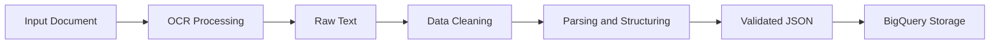
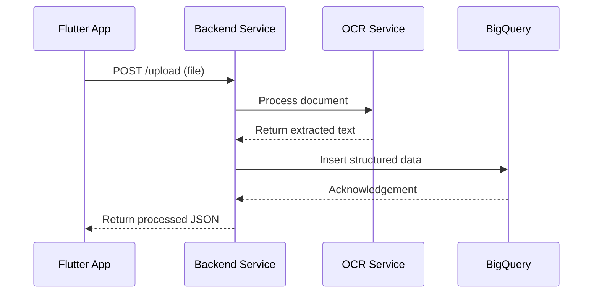


# **System Architecture and Framework**

## **1. Overview**

The system is designed as a cloud-based, scalable application that enables users to digitize medical reports through image capture or PDF upload. The architecture follows a modular, service-oriented approach to ensure maintainability, extensibility, and performance in a real-world deployment environment.

The frontend is built using Flutter to support cross-platform deployment (mobile and web), while the backend leverages cloud infrastructure to handle document processing, OCR, data transformation, and storage. The system is designed to process unstructured medical documents and convert them into structured, queryable data stored in Google BigQuery.

----------

## **2. Architectural Approach**

The system adopts the following architectural principles:

-   Client-server architecture for separation of concerns
-   Service-oriented design for independent processing components
-   Pipeline-based data processing for document transformation
-   Cloud-native deployment for scalability and reliability

This approach allows each component (OCR, parsing, storage) to evolve independently while maintaining a consistent API interface.

----------

## **3. High-Level Architecture**

```mermaid
flowchart LR
    A[Flutter Client Application] --> B[API Gateway / Backend Service]

    B --> C[Authentication Module]
    B --> D[File Upload Service]

    D --> E[OCR Processing Service]
    E --> F[Extracted Raw Text]

    F --> G[Data Parsing and Structuring Service]
    G --> H[Structured Data (JSON)]

    H --> I[(BigQuery Data Warehouse)]

    D --> J[(Cloud Object Storage)]

    I --> B
    B --> A
```

----------

## **4. System Layers**

### **4.1 Presentation Layer (Frontend)**

The presentation layer is implemented using Flutter and provides a unified interface across platforms.

**Responsibilities:**

-   Capture images using device camera
-   Upload PDF documents
-   Display extracted and processed data
-   Allow user validation and correction
-   Communicate with backend APIs

**Characteristics:**

-   Cross-platform compatibility
-   Responsive and minimal user interface
-   Stateless communication with backend

----------

### **4.2 Application Layer (Backend API)**

The backend layer serves as the central orchestration point for all operations.

**Responsibilities:**

-   Accept file uploads from the client
-   Manage request routing to processing services
-   Coordinate OCR and parsing workflows
-   Handle authentication and authorization
-   Return structured results to the client

**Recommended Technologies:**

-   Node.js (Express) or Python (FastAPI)

----------

### **4.3 Processing Layer**

This layer transforms unstructured documents into structured data.

#### **OCR Processing Service**

-   Extracts text from images and PDFs
-   Can be implemented using:
    -   Google Cloud Vision API
    -   Tesseract OCR

#### **Text Output**

-   Produces raw text data from OCR
-   May include noise and inconsistent formatting

#### **Data Parsing and Structuring Service**

-   Converts raw text into structured JSON
-   Uses techniques such as:
    -   Regular expressions
    -   Rule-based parsing
    -   Optional natural language processing

**Example Output:**

```json
{
  "patient_name": "John Doe",
  "test_name": "Blood Glucose",
  "result": "5.6 mmol/L",
  "reference_range": "4.0 - 6.0 mmol/L",
  "date": "2026-05-01"
}
```

----------

### **4.4 Data Layer**

#### **Primary Storage: Google BigQuery**

-   Stores structured medical data
-   Enables large-scale querying and analytics
-   Supports future integration with machine learning pipelines

#### **Secondary Storage: Cloud Object Storage**

-   Stores original uploaded files (optional)
-   Enables reprocessing and auditing

----------

## **5. Data Processing Framework**

The system uses a pipeline-based framework to process documents.



### **Processing Stages:**

1.  Input acquisition (image capture or PDF upload)
2.  OCR processing to extract text
3.  Data cleaning to remove noise
4.  Parsing to identify structured fields
5.  Validation to ensure data consistency
6.  Storage in BigQuery

----------

## **6. API Communication Model**

The system uses RESTful APIs for communication between frontend and backend.



### **API Design Principles**

-   Stateless request-response model
-   JSON as the standard data format
-   Secure communication via HTTPS
-   Token-based authentication (JWT or OAuth)

----------

## **7. Security Architecture**

**Data Protection:**

-   All communications secured via HTTPS
-   Authentication and authorization enforced at API level
-   Sensitive data handled with minimal exposure

**Access Control:**

-   Role-based or token-based access control
-   Secure API endpoints

**Data Privacy:**

-   Avoid unnecessary storage of raw sensitive data
-   Enable optional anonymization or masking

----------

## **8. Scalability and Performance**

**Scalability:**

-   Backend services can be scaled horizontally
-   OCR and parsing services can be separated into independent services
-   Cloud infrastructure supports auto-scaling

**Performance Optimization:**

-   Asynchronous processing for OCR tasks
-   Efficient data transformation pipelines
-   Optimized BigQuery schema design

----------

## **9. Extensibility**

The system is designed to support future enhancements:

-   Integration with analytics dashboards
-   AI-based medical insights
-   Multi-language OCR support
-   Integration with external healthcare systems

----------

## **10. Summary**

The system architecture provides a robust foundation for processing and managing medical documents in a production environment. By combining a cross-platform frontend, modular backend services, and a scalable cloud data warehouse, the system efficiently transforms unstructured data into structured, actionable information while maintaining flexibility for future expansion.
