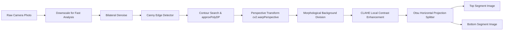

# 🏗️ MedScan — Architecture Deep-Dive

## 1. Overview & Technology Stack

MedScan is designed around a modern, modular architecture separating presentation, computer vision edge processing, AI parsing, data transformation, and clinical data persistence.

```
┌───────────────────────────────────────────────────────────────────────┐
│                      PRESENTATION TIER (FLUTTER)                      │
│  - Flutter 3.x (Dart 3.x)                                             │
│  - Custom Glassmorphism UI & Animated Onboarding Canvas               │
│  - fl_chart (Dynamic Time-Series Biomarker Curves)                    │
│  - Shared Preferences Token & Session Persistence                     │
└──────────────────────────────────┬────────────────────────────────────┘
                                   │ HTTPS REST / Multipart / SSE
                                   ▼
┌───────────────────────────────────────────────────────────────────────┐
│                     APPLICATION TIER (FASTAPI)                        │
│  - Python 3.10+ Async ASGI Framework (Uvicorn / FastAPI)              │
│  - Stateless JWT Authentication Layer (HS256)                         │
│  - Server-Sent Events (SSE) Streaming Gateway                         │
│  - Multi-Layered Patient Identity & Duplicate Detection Engine        │
└──────────────────┬───────────────────────────────┬────────────────────┘
                   │                               │
                   ▼                               ▼
┌──────────────────────────────────────┐  ┌─────────────────────────────┐
│    IMAGE PROCESSING TIER (OPENCV)    │  │    COGNITIVE TIER (OPENAI)   │
│  - OpenCV CLAHE Contrast Equalizer   │  │  - GPT-4o Vision API        │
│  - Bilateral Filtering & Dilation    │  │  - Zero-Shot Medical Schema │
│  - Four-Point Perspective Warper     │  │  - Context-Aware RAG Chat   │
│  - Otsu Horizontal Row-Gap Splitter  │  │  - Layman Summary Engine    │
└──────────────────────────────────────┘  └─────────────────────────────┘
                   │                               │
                   └───────────────┬───────────────┘
                                   │
                                   ▼
┌───────────────────────────────────────────────────────────────────────┐
│                     DATA STORAGE TIER (HYBRID)                        │
│  - Primary Cloud: Supabase PostgreSQL (JSONB + 92-Column Staging)     │
│  - Local Fallback: SQLite3 Structured Medical Storage                 │
│  - Row-Level Security (RLS) & Indexed Composite Timeseries Keys       │
└───────────────────────────────────────────────────────────────────────┘
```

---

## 2. Frontend Architecture (Flutter)

### 2.1 State Management & Architecture Pattern
The Flutter client utilizes a service-oriented architectural model with reactive controllers:
* **Service Singletons**: `AuthService`, `ApiService`, `ThemeService` manage state lifecycles and background synchronization.
* **Component Encapsulation**: Screens (`MainScreen`, `CaptureScreen`, `VerifyScreen`, `AiChatScreen`, `DictionaryScreen`, `SettingsScreen`) maintain clean view-state separations.
* **Optimistic Local Cache**: Demographic fields (`dob`, `ic_number`, `gender`) and JWT tokens are stored in `SharedPreferences` to enable instant offline dashboard boots.

### 2.2 Navigation Hierarchy
The main application structure is controlled by `MainScreen` using a 5-tab indexed view:
```
MainScreen
 ├── Tab 0: Dashboard (Longitudinal biomarker charts, summary card, multi-attribute comparisons)
 ├── Tab 1: Scan & Digitize (Camera / gallery picker, scanner mode switch, multipage upload)
 ├── Tab 2: AI Health Assistant (Conversational RAG, SSE markdown streaming, session management)
 ├── Tab 3: Medical Dictionary (Searchable 92-biomarker encyclopedia with reference ranges)
 └── Tab 4: Settings (Profile editor, dark/light theme, API base URL switch, user guide tour)
```

### 2.3 Verification Screen Architecture (`VerifyScreen`)
The verification screen operates under a **Dual-Mode Dynamic Locking Pattern**:
* **Fresh Upload / Unverified (`userVerified == false`)**:
  - UI starts in **Unlocked Edit Mode**.
  - Form fields are immediately interactive; autocorrect triggers on field focus loss (`FocusNode`).
  - Send button commits changes and invokes the backend database persistence routine.
* **Historical Report (`userVerified == true`)**:
  - UI defaults to **Locked Read-Only Mode**.
  - All form controls are disabled to prevent accidental modifications.
  - Tapping the pencil icon (`Icons.edit_outlined`) triggers an explicit confirmation dialog (`"Are you sure you want to edit [Field Name]?"`), unlocking solely the selected field.

---

## 3. Computer Vision & Preprocessing Pipeline

Scanned documents captured via mobile cameras suffer from angular perspective distortion, non-uniform lighting, paper wrinkles, and small fonts. MedScan employs an automated OpenCV pipeline before invoking OCR models.



### 3.1 Document Corner Detection & Perspective Warping (`detector.py` & `perspective.py`)
1. **Downscaling**: Images are proportionally resized to a height of $500\text{px}$ to standardize edge detection thresholds regardless of camera resolution.
2. **Noise Suppression**: An edge-preserving `cv2.bilateralFilter(gray, 9, 75, 75)` eliminates digital sensor noise and laptop screen moiré patterns.
3. **Contour Extraction**: `cv2.Canny(blurred, 75, 200)` generates gradient boundaries. Contours are filtered to those exceeding $15\%$ of total image area.
4. **Quadrilateral Approximation**: `cv2.approxPolyDP(contour, 0.02 * perimeter, True)` identifies 4-point convex shapes.
5. **Coordinate Ordering**: Corners are sorted into top-left, top-right, bottom-right, and bottom-left using coordinate sum ($\min(x+y)$, $\max(x+y)$) and difference ($\max(x-y)$, $\min(x-y)$) equations.
6. **Warp Transformation**: Computes width $W = \max(\|TR-TL\|, \|BR-BL\|)$ and height $H = \max(\|TR-BR\|, \|TL-BL\|)$, generating a planar rectangular matrix via `cv2.getPerspectiveTransform()`.

### 3.2 Illumination Normalization & CLAHE (`enhancer.py`)
1. **Background Mask Estimation**: Applies a large morphological dilation kernel ($7\times 7$) followed by a median blur with a $21\times 21$ kernel to isolate illumination variations while erasing text.
2. **Division Normalization**: Dividing the original image channels by the estimated background illumination mask cancels out shadow gradients, producing a clean white page backdrop.
3. **Contrast Equalization**: Applies Contrast Limited Adaptive Histogram Equalization (`clipLimit=2.0`, `tileGridSize=(8, 8)`) to sharpen dark text strokes without blowing out thin lines.

### 3.3 Content-Aware Horizontal Projection Row-Splitter (`splitter.py`)
To prevent token truncation and eliminate line-skipping errors on dense multi-column laboratory tables:
1. **Horizontal Projection Profile**: The image is binarized using Otsu's thresholding (`cv2.THRESH_BINARY_INV + cv2.THRESH_OTSU`). Foreground dark pixels are summed horizontally row-by-row:
   $$P(y) = \sum_{x=0}^{W-1} I_{\text{bin}}(x, y)$$
2. **Whitespace Gap Identification**: Rows where $P(y) < 0.02 \times \max(P)$ are classified as whitespace gap candidates. Contiguous gap rows $\ge 5\text{px}$ in height are clustered into discrete bands.
3. **Midpoint Gap Optimization**: Scans the middle $70\%$ zone ($35\%$ above and below vertical midpoint) and selects the whitespace band whose centroid is closest to the mathematical center.
4. **Safety Margin Overlap**: Slices the image into top and bottom halves with a $3\%$ height overlap margin, ensuring characters on the boundary are never sliced in half.

---

## 4. AI Parsing & RAG Analytics Architecture

### 4.1 Vision Extraction Gateway
Each image segment is encoded as a base64 JPEG payload and submitted to `OpenAI GPT-4o` with a structured system prompt instructing the model to output a strict JSON schema:
* Administrative metadata: `patient_name`, `patient_id`, `gender`, `age`, `dob`, `ic_number`, `collected`, `time`, `labreference`, `report_reference`, `lab`.
* Clinical measurement array: `results: [{ test_item, value, unit, reference_range, key }]`.
* Multi-page responses are merged and deduplicated on the backend before returning to the client.

### 4.2 Streaming RAG Health Assistant (`/api/reports/analyze/stream`)
The conversational AI health assistant utilizes a **Retrieval-Augmented Generation (RAG)** architecture:

```mermaid
flowchart TD
    UserQuery[User Question in Chat Screen] --> StreamEndpoint["POST /api/reports/analyze/stream"]
    StreamEndpoint --> FetchDB["Query Supabase for User Historical Reports"]
    FetchDB --> BuildMatrix["Construct Clinical Time-Series Context Matrix"]
    BuildMatrix --> AssemblePrompt["Inject System Persona + Chat History + Biomarkers"]
    AssemblePrompt --> OpenAICall["OpenAI Chat Stream (gpt-4o)"]
    OpenAICall -->|Token Chunk| SSEParser["FastAPI SSE Event Stream generator"]
    SSEParser -->|data: {'token': '...'}| FlutterClient["Flutter Streamed Markdown Viewer"]
    FlutterClient --> RenderUI["Realtime Typewriter Bubble Display"]
```

* **Context Construction**: When a query is initiated, all historical reports for the authenticated `user_id` within the selected date range are aggregated into a tabular markdown summary of normalized values, timestamps, and out-of-range clinical flags.
* **Clinical Guardrails**: System prompt enforces medical communication guardrails:
  - Explains complex parameters in accessible layman terms.
  - Highlights abnormal biomarkers with potential lifestyle contexts.
  - Includes standard clinical disclaimers advising professional physician consultation.
* **Server-Sent Events (SSE)**: Streams tokens chunk-by-chunk using `text/event-stream` formatted events (`data: {"token": "..."}\n\n`), concluding with `data: [DONE]\n\n`.
