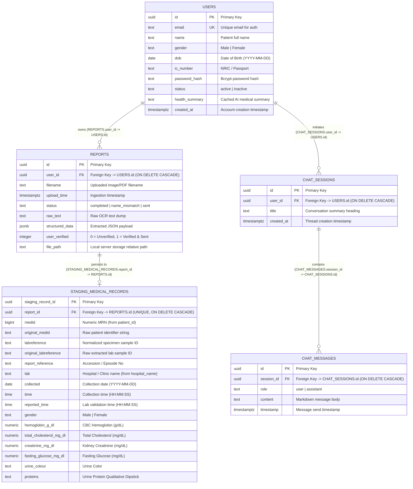
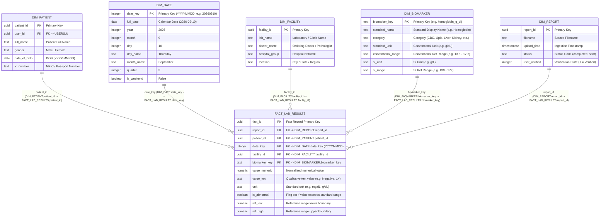

# 🗄️ MedScan — Database Schema & Data Modeling

## 1. Overview & Storage Strategy

MedScan employs a hybrid relational database architecture designed to separate operational transaction handling (document ingestion, verification, real-time AI chat) from longitudinal clinical analytics and healthcare reporting.

* **Operational Engine (OLTP - Production)**: **Supabase PostgreSQL 15+** with Row Level Security (RLS) and JSONB indexing.
* **Fallback Engine (OLTP - Local Dev)**: **SQLite3** (`medical_reports.db`) supporting standard SQL syntax and offline prototyping.
* **Analytical Architecture (OLAP - Data Warehouse)**: **Dimensional Star Schema** designed for BigQuery, PostgreSQL Views, and multi-year clinical trend analytics.

---

## 2. Operational Entity-Relationship (ER) Diagram (OLTP)

This schema handles user authentication, raw document storage, human verification, and interactive chat sessions.



---

## 3. Dimensional Star Schema Diagram (OLAP / Analytics)

For large-scale longitudinal healthcare analytics, BigQuery data warehousing, and business intelligence (Metabase, Tableau, Superset), the wide staging table is projected into a **Dimensional Star Schema**:



---

## 4. Cross-Layer Naming & Data Mapping Reference

The following table documents the exact field mappings between presentation layer (Flutter client `StructuredData`), FastAPI backend OCR parser, and SQL database schemas:

| Conceptual Field | Flutter `StructuredData` (JSON) | FastAPI Parser (`metadata`) | `staging_medical_records` (SQL) | Star Schema Dimension / Fact |
| :--- | :--- | :--- | :--- | :--- |
| **Primary Key** | `id` | `id` | `staging_record_id` | `FACT_LAB_RESULTS.fact_id` |
| **Report Parent FK** | `reportId` | `report_id` | `report_id` | `FACT_LAB_RESULTS.report_id` |
| **Patient MRN (Numeric)** | `patientId` | `medid` | `medid` | `DIM_PATIENT.patient_id` |
| **Patient MRN (Raw String)**| `patientId` | `original_medid` | `original_medid` | `DIM_PATIENT.ic_number` / MRN |
| **Lab Sample ID** | `labreference` | `labreference` | `labreference` | `FACT_LAB_RESULTS.labreference` |
| **Raw Sample ID** | `labreference` | `original_labreference` | `original_labreference` | *(Audit field)* |
| **Report Accession No** | `reportReference` | `report_reference` | `report_reference` | `DIM_REPORT.report_reference` |
| **Hospital / Clinic Name** | `hospitalName` | `hospital_name` / `lab` | `lab` | `DIM_FACILITY.lab_name` |
| **Specimen Collection Date**| `date` / `collected` | `collected` | `collected` | `DIM_DATE.full_date` / `date_key` |
| **Specimen Collection Time**| `time` | `time` | `time` | `FACT_LAB_RESULTS.time` |
| **Validation / Sign-off Time**| *(none)* | `reported_time` | `reported_time` | `FACT_LAB_RESULTS.reported_time` |
| **Patient Gender** | `gender` | `gender` | `gender` | `DIM_PATIENT.gender` |
| **Biomarker Measurements** | `results: [{key, value, unit}]`| `final_data[key]` | *Individual columns* (e.g. `hemoglobin_g_dl`)| `FACT_LAB_RESULTS.value_numeric` + `biomarker_key` |

---

## 5. Master PostgreSQL DDL (Supabase)

```sql
-- Enable UUID generation
CREATE EXTENSION IF NOT EXISTS "uuid-ossp";
CREATE EXTENSION IF NOT EXISTS "pgcrypto";

-- 1. USERS TABLE
CREATE TABLE IF NOT EXISTS users (
    id             UUID PRIMARY KEY DEFAULT gen_random_uuid(),
    email          TEXT UNIQUE NOT NULL,
    name           TEXT NOT NULL,
    gender         TEXT,                                     -- 'Male' | 'Female'
    dob            DATE,                                     -- YYYY-MM-DD
    ic_number      TEXT,                                     -- NRIC or Passport
    password_hash  TEXT NOT NULL,                            -- bcrypt hash
    status         TEXT NOT NULL DEFAULT 'active',           -- 'active' | 'inactive'
    health_summary TEXT,                                     -- Cached markdown AI health summary
    created_at     TIMESTAMPTZ NOT NULL DEFAULT now()
);

CREATE INDEX IF NOT EXISTS idx_users_email ON users (email);

-- 2. REPORTS TABLE
CREATE TABLE IF NOT EXISTS reports (
    id               UUID PRIMARY KEY DEFAULT gen_random_uuid(),
    user_id          UUID NOT NULL REFERENCES users(id) ON DELETE CASCADE,
    filename         TEXT NOT NULL,
    upload_time      TIMESTAMPTZ NOT NULL DEFAULT now(),
    status           TEXT NOT NULL DEFAULT 'processing',     -- 'completed' | 'name_mismatch' | 'sent'
    raw_text         TEXT,
    structured_data  JSONB,                                  -- Extracted JSON payload
    user_verified    INTEGER NOT NULL DEFAULT 0,              -- 0 = unverified, 1 = verified & sent
    file_path        TEXT
);

CREATE INDEX IF NOT EXISTS idx_reports_user_id ON reports (user_id);
CREATE INDEX IF NOT EXISTS idx_reports_upload_time ON reports (upload_time DESC);

-- 3. CHAT SESSIONS TABLE
CREATE TABLE IF NOT EXISTS chat_sessions (
    id          UUID PRIMARY KEY DEFAULT gen_random_uuid(),
    user_id     UUID NOT NULL REFERENCES users(id) ON DELETE CASCADE,
    title       TEXT NOT NULL,
    created_at  TIMESTAMPTZ NOT NULL DEFAULT now()
);

CREATE INDEX IF NOT EXISTS idx_chat_sessions_user_id ON chat_sessions (user_id);

-- 4. CHAT MESSAGES TABLE
CREATE TABLE IF NOT EXISTS chat_messages (
    id          UUID PRIMARY KEY DEFAULT gen_random_uuid(),
    session_id  UUID NOT NULL REFERENCES chat_sessions(id) ON DELETE CASCADE,
    role        TEXT NOT NULL,                              -- 'user' | 'assistant'
    content     TEXT NOT NULL,
    timestamp   TIMESTAMPTZ NOT NULL DEFAULT now()
);

CREATE INDEX IF NOT EXISTS idx_chat_messages_session_id ON chat_messages (session_id);

-- 5. STAGING MEDICAL RECORDS TABLE
CREATE TABLE IF NOT EXISTS staging_medical_records (
    staging_record_id           UUID PRIMARY KEY DEFAULT gen_random_uuid(),
    report_id                   UUID NOT NULL UNIQUE REFERENCES reports(id) ON DELETE CASCADE,
    medid                       BIGINT,                     -- Normalized numeric patient identifier
    original_medid              TEXT,                       -- Raw extracted patient ID / MRN
    labreference                TEXT,                       -- Normalized sample ID
    original_labreference       TEXT,                       -- Raw extracted specimen reference
    report_reference            TEXT,                       -- Accession / Episode number
    lab                         TEXT,                       -- Issuing clinic / hospital name
    collected                   DATE,                       -- Specimen collection date (YYYY-MM-DD)
    time                        TIME,                       -- Specimen collection time (HH:MM:SS)
    reported_time               TIME,                       -- Laboratory validation time (HH:MM:SS)
    gender                      TEXT,                       -- 'Male' | 'Female'

    -- 1. URINALYSIS
    urine_colour                TEXT,
    appearance                  TEXT,
    specific_gravity            NUMERIC,
    ph                          NUMERIC,
    proteins                    TEXT,
    glucose                     TEXT,
    bilirubin                   TEXT,
    ketones                     TEXT,
    blood                       TEXT,
    urobilinogen                TEXT,
    nitrites                    TEXT,
    wbc_pus_cells_hpf           TEXT,
    rbc                         TEXT,
    epithelial_cells_hpf        TEXT,
    casts                       TEXT,
    crystals                    TEXT,
    others                      TEXT,

    -- 2. COMPLETE BLOOD COUNT (CBC)
    hemoglobin_g_dl             NUMERIC,
    rbc_count_mil_ul            NUMERIC,
    hematocrit_pct              NUMERIC,
    mcv_fl                      NUMERIC,
    mch_pg                      NUMERIC,
    mchc_g_dl                   NUMERIC,
    rdw_cv_pct                  NUMERIC,
    rdw_sd_fl                   NUMERIC,
    wbc_cells_ul                NUMERIC,
    neutrophils_pct             NUMERIC,
    lymphocytes_pct             NUMERIC,
    eosinophils_pct             NUMERIC,
    monocytes_pct               NUMERIC,
    basophils_pct               NUMERIC,
    abs_neutrophils             NUMERIC,
    abs_lymphocytes             NUMERIC,
    abs_monocytes               NUMERIC,
    abs_eosinophils             NUMERIC,
    abs_basophils               NUMERIC,

    -- 3. PLATELET PROFILE
    platelet_count_x10_3_ul     NUMERIC,
    mpv_fl                      NUMERIC,
    platelet_rdw_pct            NUMERIC,
    pct_pct                     NUMERIC,
    p_lcr_pct                   NUMERIC,
    img_pct                     NUMERIC,
    imm_pct                     NUMERIC,
    iml_pct                     NUMERIC,
    lic_pct                     NUMERIC,

    -- 4. LIPID PROFILE
    total_cholesterol_mg_dl     NUMERIC,
    hdl_mg_dl                   NUMERIC,
    ldl_mg_dl                   NUMERIC,
    vldl_mg_dl                  NUMERIC,
    triglycerides_mg_dl         NUMERIC,
    non_hdl_mg_dl               NUMERIC,
    total_hdl_ratio             NUMERIC,
    ldl_hdl_ratio               NUMERIC,
    hdl_ldl_ratio               NUMERIC,

    -- 5. LIVER FUNCTION
    bilirubin_total_mg_dl       NUMERIC,
    bilirubin_direct_mg_dl      NUMERIC,
    bilirubin_indirect_mg_dl    NUMERIC,
    alp_u_l                     NUMERIC,
    alt_sgpt_u_l                NUMERIC,
    ast_sgot_u_l                NUMERIC,
    ggt_u_l                     NUMERIC,
    protein_total_g_dl          NUMERIC,
    albumin_g_dl                NUMERIC,
    globulin_g_dl               NUMERIC,
    a_g_ratio                   NUMERIC,

    -- 6. KIDNEY FUNCTION & ELECTROLYTES
    creatinine_mg_dl            NUMERIC,
    urea_mg_dl                  NUMERIC,
    bun_mg_dl                   NUMERIC,
    bun_creatinine_ratio        NUMERIC,
    sodium_mmol_l               NUMERIC,
    potassium_mmol_l            NUMERIC,
    chloride_mmol_l             NUMERIC,
    uric_acid_mg_dl             NUMERIC,
    egfr_ml_min_173m2           NUMERIC,

    -- 7. IRON PROFILE
    iron_ug_dl                  NUMERIC,
    uibc_ug_dl                  NUMERIC,
    tibc_ug_dl                  NUMERIC,
    transferrin_saturation_pct  NUMERIC,

    -- 8. DIABETIC / GLYCEMIC
    hba1c_pct                   NUMERIC,
    estimated_avg_glucose_mg_dl NUMERIC,
    hbf_pct                     NUMERIC,
    fasting_glucose_mg_dl       NUMERIC,
    postprandial_glucose_mg_dl  NUMERIC,
    fbs_mg_dl                   NUMERIC,
    plbs_mg_dl                  NUMERIC,

    -- 9. RENAL PROTEINURIA / ACR
    urine_albumin_mg_l          NUMERIC,
    urine_creatinine_mg_dl      NUMERIC,
    albumin_creatinine_ratio    NUMERIC,

    -- 10. MINERALS & BONE
    calcium_mg_dl               NUMERIC,
    phosphorus_mg_dl            NUMERIC,

    -- 11. THYROID PROFILE
    tt3_ng_dl                   NUMERIC,
    tt4_ug_dl                   NUMERIC,
    tsh_uiu_ml                  NUMERIC
);

CREATE INDEX IF NOT EXISTS idx_staging_report_id ON staging_medical_records (report_id);
CREATE INDEX IF NOT EXISTS idx_staging_medid_collected ON staging_medical_records (medid, collected);

-- 6. ROW LEVEL SECURITY (RLS) POLICIES
ALTER TABLE users ENABLE ROW LEVEL SECURITY;
ALTER TABLE reports ENABLE ROW LEVEL SECURITY;
ALTER TABLE chat_sessions ENABLE ROW LEVEL SECURITY;
ALTER TABLE chat_messages ENABLE ROW LEVEL SECURITY;
ALTER TABLE staging_medical_records ENABLE ROW LEVEL SECURITY;

CREATE POLICY "Allow all access to users" ON users FOR ALL USING (true) WITH CHECK (true);
CREATE POLICY "Allow all access to reports" ON reports FOR ALL USING (true) WITH CHECK (true);
CREATE POLICY "Allow all access to chat_sessions" ON chat_sessions FOR ALL USING (true) WITH CHECK (true);
CREATE POLICY "Allow all access to chat_messages" ON chat_messages FOR ALL USING (true) WITH CHECK (true);
CREATE POLICY "Allow all access to staging_medical_records" ON staging_medical_records FOR ALL USING (true) WITH CHECK (true);

-- 7. POST-MAY 2026 API ROLE GRANTS
GRANT SELECT, INSERT, UPDATE, DELETE ON TABLE users TO anon, authenticated, service_role;
GRANT SELECT, INSERT, UPDATE, DELETE ON TABLE reports TO anon, authenticated, service_role;
GRANT SELECT, INSERT, UPDATE, DELETE ON TABLE chat_sessions TO anon, authenticated, service_role;
GRANT SELECT, INSERT, UPDATE, DELETE ON TABLE chat_messages TO anon, authenticated, service_role;
GRANT SELECT, INSERT, UPDATE, DELETE ON TABLE staging_medical_records TO anon, authenticated, service_role;
```

---

## 6. Dimensional Star Schema View Definitions (PostgreSQL OLAP)

To query the data warehouse via Star Schema without altering the operational backend write path, the following PostgreSQL Views project the normalized relational tables into facts and dimensions:

```sql
-- 1. DIM_PATIENT VIEW
CREATE OR REPLACE VIEW dim_patient AS
SELECT 
    u.id AS patient_id,
    u.id AS user_id,
    u.name AS full_name,
    u.gender,
    u.dob AS date_of_birth,
    u.ic_number,
    u.created_at AS registered_at
FROM users u;

-- 2. DIM_FACILITY VIEW
CREATE OR REPLACE VIEW dim_facility AS
SELECT DISTINCT
    md5(COALESCE(lab, 'Unknown Facility'))::uuid AS facility_id,
    COALESCE(lab, 'Unknown Facility') AS lab_name,
    NULL::TEXT AS doctor_name,
    NULL::TEXT AS hospital_group,
    NULL::TEXT AS location
FROM staging_medical_records;

-- 3. DIM_DATE VIEW
CREATE OR REPLACE VIEW dim_date AS
SELECT DISTINCT
    TO_CHAR(collected, 'YYYYMMDD')::INTEGER AS date_key,
    collected AS full_date,
    EXTRACT(YEAR FROM collected)::INTEGER AS year,
    EXTRACT(MONTH FROM collected)::INTEGER AS month,
    EXTRACT(DAY FROM collected)::INTEGER AS day,
    TO_CHAR(collected, 'Day') AS day_name,
    TO_CHAR(collected, 'Month') AS month_name,
    EXTRACT(QUARTER FROM collected)::INTEGER AS quarter,
    CASE WHEN EXTRACT(ISODOW FROM collected) IN (6, 7) THEN TRUE ELSE FALSE END AS is_weekend
FROM staging_medical_records
WHERE collected IS NOT NULL;

-- 4. DIM_REPORT VIEW
CREATE OR REPLACE VIEW dim_report AS
SELECT
    r.id AS report_id,
    r.filename,
    r.upload_time,
    r.status,
    r.user_verified
FROM reports r;

-- 5. FACT_LAB_RESULTS (UNPIVOTED CLINICAL FACTS)
CREATE OR REPLACE VIEW fact_lab_results AS
WITH raw_facts AS (
    SELECT 
        s.staging_record_id AS fact_id,
        s.report_id,
        r.user_id AS patient_id,
        TO_CHAR(s.collected, 'YYYYMMDD')::INTEGER AS date_key,
        md5(COALESCE(s.lab, 'Unknown Facility'))::uuid AS facility_id,
        s.time,
        s.reported_time,
        kv.key AS biomarker_key,
        CASE WHEN kv.value ~ '^[0-9]+(\.[0-9]+)?$' THEN kv.value::NUMERIC ELSE NULL END AS value_numeric,
        kv.value AS value_text
    FROM staging_medical_records s
    JOIN reports r ON s.report_id = r.id
    CROSS JOIN LATERAL jsonb_each_text(to_jsonb(s)) AS kv(key, value)
    WHERE kv.key NOT IN (
        'staging_record_id', 'report_id', 'medid', 'original_medid', 
        'labreference', 'original_labreference', 'report_reference', 
        'lab', 'collected', 'time', 'reported_time', 'gender'
    )
    AND kv.value IS NOT NULL AND TRIM(kv.value) != ''
)
SELECT 
    fact_id,
    report_id,
    patient_id,
    date_key,
    facility_id,
    time,
    reported_time,
    biomarker_key,
    value_numeric,
    value_text
FROM raw_facts;
```

---

## 7. Sample Analytical Queries using Star Schema

### 7.1 Multi-Year Patient HbA1c Longitudinal Progression
```sql
SELECT 
    d.full_date,
    p.full_name,
    f.value_numeric AS hba1c_percentage,
    CASE 
        WHEN f.value_numeric < 5.7 THEN 'Normal'
        WHEN f.value_numeric BETWEEN 5.7 AND 6.4 THEN 'Prediabetes'
        ELSE 'Diabetes'
    END AS clinical_tier
FROM fact_lab_results f
JOIN dim_patient p ON f.patient_id = p.patient_id
JOIN dim_date d ON f.date_key = d.date_key
WHERE f.biomarker_key = 'hba1c_pct'
  AND p.user_id = 'c1234567-89ab-cdef-0123-456789abcdef'
ORDER BY d.full_date ASC;
```

### 7.2 Abnormal Lipid Profile Distribution Across Clinic Facilities
```sql
SELECT 
    fac.lab_name,
    COUNT(f.fact_id) AS total_cholesterol_tests,
    AVG(f.value_numeric) AS average_cholesterol_mg_dl,
    COUNT(CASE WHEN f.value_numeric > 200 THEN 1 END) AS high_cholesterol_count
FROM fact_lab_results f
JOIN dim_facility fac ON f.facility_id = fac.facility_id
WHERE f.biomarker_key = 'total_cholesterol_mg_dl'
GROUP BY fac.lab_name
ORDER BY total_cholesterol_tests DESC;
```

---

## 8. Local Development SQLite DDL

```sql
PRAGMA foreign_keys = ON;

CREATE TABLE IF NOT EXISTS users (
    id             TEXT PRIMARY KEY,
    email          TEXT UNIQUE NOT NULL,
    name           TEXT NOT NULL,
    password_hash  TEXT NOT NULL,
    status         TEXT NOT NULL DEFAULT 'active',
    gender         TEXT,
    dob            DATE,
    ic_number      TEXT,
    health_summary TEXT,
    created_at     TEXT NOT NULL
);

CREATE TABLE IF NOT EXISTS reports (
    id             TEXT PRIMARY KEY,
    user_id        TEXT NOT NULL REFERENCES users(id) ON DELETE CASCADE,
    filename       TEXT NOT NULL,
    upload_time    TEXT NOT NULL,
    status         TEXT NOT NULL DEFAULT 'processing',
    raw_text       TEXT,
    structured_data TEXT,
    user_verified  INTEGER DEFAULT 0,
    file_path      TEXT
);

CREATE TABLE IF NOT EXISTS chat_sessions (
    id          TEXT PRIMARY KEY,
    user_id     TEXT NOT NULL REFERENCES users(id) ON DELETE CASCADE,
    created_at  TEXT NOT NULL,
    title       TEXT NOT NULL
);

CREATE TABLE IF NOT EXISTS chat_messages (
    id          TEXT PRIMARY KEY,
    session_id  TEXT NOT NULL REFERENCES chat_sessions(id) ON DELETE CASCADE,
    role        TEXT NOT NULL,
    content     TEXT NOT NULL,
    timestamp   TEXT NOT NULL
);

CREATE TABLE IF NOT EXISTS health_summary_cache (
    user_id     TEXT PRIMARY KEY REFERENCES users(id) ON DELETE CASCADE,
    summary     TEXT NOT NULL,
    updated_at  TEXT NOT NULL
);

CREATE TABLE IF NOT EXISTS staging_medical_records (
    staging_record_id           TEXT PRIMARY KEY,
    report_id                   TEXT NOT NULL UNIQUE REFERENCES reports(id) ON DELETE CASCADE,
    medid                       INTEGER,
    original_medid              TEXT,
    labreference                TEXT,
    original_labreference       TEXT,
    report_reference            TEXT,
    lab                         TEXT,
    collected                   DATE,
    time                        TIME,
    reported_time               TIME,
    gender                      TEXT,
    urine_colour                TEXT,
    appearance                  TEXT,
    specific_gravity            REAL,
    ph                          REAL,
    proteins                    TEXT,
    glucose                     TEXT,
    bilirubin                   TEXT,
    ketones                     TEXT,
    blood                       TEXT,
    urobilinogen                TEXT,
    nitrites                    TEXT,
    wbc_pus_cells_hpf           TEXT,
    rbc                         TEXT,
    epithelial_cells_hpf        TEXT,
    casts                       TEXT,
    crystals                    TEXT,
    others                      TEXT,
    hemoglobin_g_dl             REAL,
    rbc_count_mil_ul            REAL,
    hematocrit_pct              REAL,
    mcv_fl                      REAL,
    mch_pg                      REAL,
    mchc_g_dl                   REAL,
    rdw_cv_pct                  REAL,
    rdw_sd_fl                   REAL,
    wbc_cells_ul                REAL,
    neutrophils_pct             REAL,
    lymphocytes_pct             REAL,
    eosinophils_pct             REAL,
    monocytes_pct               REAL,
    basophils_pct               REAL,
    abs_neutrophils             REAL,
    abs_lymphocytes             REAL,
    abs_monocytes               REAL,
    abs_eosinophils             REAL,
    abs_basophils               REAL,
    platelet_count_x10_3_ul     REAL,
    mpv_fl                      REAL,
    platelet_rdw_pct            REAL,
    pct_pct                     REAL,
    p_lcr_pct                   REAL,
    img_pct                     REAL,
    imm_pct                     REAL,
    iml_pct                     REAL,
    lic_pct                     REAL,
    total_cholesterol_mg_dl     REAL,
    hdl_mg_dl                   REAL,
    ldl_mg_dl                   REAL,
    vldl_mg_dl                  REAL,
    triglycerides_mg_dl         REAL,
    non_hdl_mg_dl               REAL,
    total_hdl_ratio             REAL,
    ldl_hdl_ratio               REAL,
    hdl_ldl_ratio               REAL,
    bilirubin_total_mg_dl       REAL,
    bilirubin_direct_mg_dl      REAL,
    bilirubin_indirect_mg_dl    REAL,
    alp_u_l                     REAL,
    alt_sgpt_u_l                REAL,
    ast_sgot_u_l                REAL,
    ggt_u_l                     REAL,
    protein_total_g_dl          REAL,
    albumin_g_dl                REAL,
    globulin_g_dl               REAL,
    a_g_ratio                   REAL,
    creatinine_mg_dl            REAL,
    urea_mg_dl                  REAL,
    bun_mg_dl                   REAL,
    bun_creatinine_ratio        REAL,
    sodium_mmol_l               REAL,
    potassium_mmol_l            REAL,
    chloride_mmol_l             REAL,
    uric_acid_mg_dl             REAL,
    egfr_ml_min_173m2           REAL,
    iron_ug_dl                  REAL,
    uibc_ug_dl                  REAL,
    tibc_ug_dl                  REAL,
    transferrin_saturation_pct  REAL,
    hba1c_pct                   REAL,
    estimated_avg_glucose_mg_dl REAL,
    hbf_pct                     REAL,
    urine_albumin_mg_l          REAL,
    urine_creatinine_mg_dl      REAL,
    albumin_creatinine_ratio    REAL,
    calcium_mg_dl               REAL,
    phosphorus_mg_dl            REAL,
    tt3_ng_dl                   REAL,
    tt4_ug_dl                   REAL,
    tsh_uiu_ml                  REAL,
    fasting_glucose_mg_dl       REAL,
    postprandial_glucose_mg_dl  REAL,
    fbs_mg_dl                   REAL,
    plbs_mg_dl                  REAL
);
```
