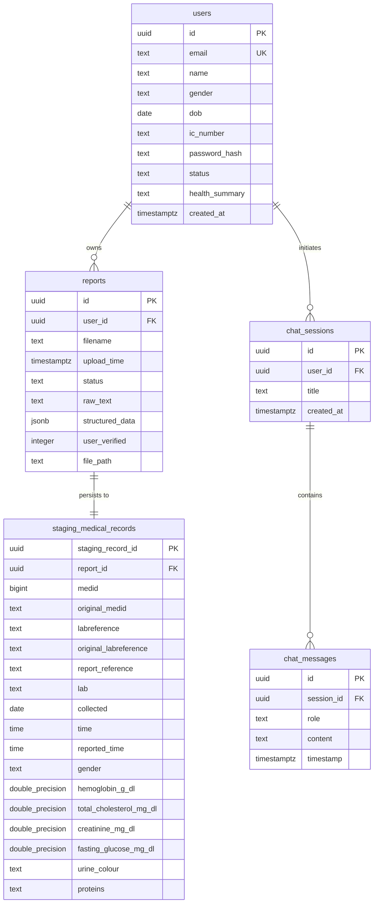

# 🗄️ MedScan — Database Schema & Data Modeling

## 1. Overview & Storage Strategy

MedScan employs a hybrid relational database architecture designed to separate administrative document storage from high-performance longitudinal time-series analytics.

* **Primary Engine (Production)**: **Supabase PostgreSQL 15+** with Row Level Security (RLS) and JSONB support.
* **Fallback Engine (Development / Testing)**: **SQLite3** (`medical_reports.db`) supporting standard SQL syntax and offline prototyping.

---

## 2. Entity-Relationship (ER) Diagram



---

## 3. Core Database Tables

### 3.1 `users` Table
Stores patient demographic profiles used for identity verification against extracted OCR metadata, authentication credentials, and cached AI medical summaries.

```sql
CREATE TABLE users (
    id             UUID PRIMARY KEY DEFAULT gen_random_uuid(),
    email          TEXT UNIQUE NOT NULL,
    name           TEXT NOT NULL,
    gender         TEXT,                                     -- "Male" or "Female"
    dob            DATE,                                     -- YYYY-MM-DD
    ic_number      TEXT,                                     -- NRIC or Passport
    password_hash  TEXT NOT NULL,                            -- bcrypt hash
    status         TEXT NOT NULL DEFAULT 'active',           -- 'active' | 'inactive'
    health_summary TEXT,                                     -- Cached markdown summary
    created_at     TIMESTAMPTZ NOT NULL DEFAULT now()
);

CREATE INDEX idx_users_email ON users (email);
```

### 3.2 `reports` Table
Stores raw document extraction JSON structures, upload timestamps, file references, and human verification confirmation states.

```sql
CREATE TABLE reports (
    id               UUID PRIMARY KEY DEFAULT gen_random_uuid(),
    user_id          UUID REFERENCES users(id) ON DELETE CASCADE,
    filename         TEXT NOT NULL,
    upload_time      TIMESTAMPTZ NOT NULL DEFAULT now(),
    status           TEXT NOT NULL DEFAULT 'processing',     -- 'completed' | 'name_mismatch' | etc.
    raw_text         TEXT,
    structured_data  JSONB,                                  -- Complete nested extracted JSON
    user_verified    INTEGER DEFAULT 0,                      -- 0 = fresh/unverified, 1 = verified
    file_path        TEXT
);

CREATE INDEX idx_reports_user_id ON reports (user_id);
```

### 3.3 `chat_sessions` & `chat_messages` Tables
Supports persistent conversational context for the AI health assistant.

```sql
CREATE TABLE chat_sessions (
    id          UUID PRIMARY KEY DEFAULT gen_random_uuid(),
    user_id     UUID REFERENCES users(id) ON DELETE CASCADE,
    title       TEXT NOT NULL,
    created_at  TIMESTAMPTZ NOT NULL DEFAULT now()
);

CREATE INDEX idx_chat_sessions_user_id ON chat_sessions (user_id);

CREATE TABLE chat_messages (
    id          UUID PRIMARY KEY DEFAULT gen_random_uuid(),
    session_id  UUID REFERENCES chat_sessions(id) ON DELETE CASCADE,
    role        TEXT NOT NULL,                              -- 'user' | 'assistant'
    content     TEXT NOT NULL,
    timestamp   TIMESTAMPTZ NOT NULL DEFAULT now()
);

CREATE INDEX idx_chat_messages_session_id ON chat_messages (session_id);
```

---

## 4. The 92-Column Staging Schema (`staging_medical_records`)

The `staging_medical_records` table holds normalized numeric and qualitative biomarkers across 14 clinical categories. Each row represents a single finalized diagnostic lab report.

```sql
CREATE TABLE staging_medical_records (
    staging_record_id           UUID PRIMARY KEY DEFAULT gen_random_uuid(),
    report_id                   UUID REFERENCES reports(id) ON DELETE CASCADE,
    medid                       BIGINT,                     -- Normalised numeric patient identifier
    original_medid              TEXT,                       -- Raw extracted patient ID / MRN
    labreference                TEXT,                       -- Normalized sample ID
    original_labreference       TEXT,                       -- Raw extracted specimen reference
    report_reference            TEXT,                       -- Accession / Episode number
    lab                         TEXT,                       -- Issuing clinic or laboratory name
    collected                   DATE,                       -- Specimen collection date
    time                        TIME,                       -- Specimen collection time
    reported_time               TIME,                       -- Laboratory report sign-off time
    gender                      TEXT,                       -- 'Male' | 'Female'

    -- 1. URINALYSIS
    urine_colour                TEXT,
    appearance                  TEXT,
    specific_gravity            DOUBLE PRECISION,
    ph                          DOUBLE PRECISION,
    proteins                    TEXT,
    glucose                     TEXT,
    bilirubin                   TEXT,
    ketones                     TEXT,
    blood                       TEXT,
    urobilinogen                TEXT,
    nitrites                    TEXT,
    wbc_pus_cells_hpf           TEXT,
    rbc                         TEXT,
    epithelial_cells_hpf        TEXT,
    casts                       TEXT,
    crystals                    TEXT,
    others                      TEXT,

    -- 2. COMPLETE BLOOD COUNT (CBC)
    hemoglobin_g_dl             DOUBLE PRECISION,
    rbc_count_mil_ul            DOUBLE PRECISION,
    hematocrit_pct              DOUBLE PRECISION,
    mcv_fl                      DOUBLE PRECISION,
    mch_pg                      DOUBLE PRECISION,
    mchc_g_dl                   DOUBLE PRECISION,
    rdw_cv_pct                  DOUBLE PRECISION,
    rdw_sd_fl                   DOUBLE PRECISION,
    wbc_cells_ul                DOUBLE PRECISION,
    neutrophils_pct             DOUBLE PRECISION,
    lymphocytes_pct             DOUBLE PRECISION,
    eosinophils_pct             DOUBLE PRECISION,
    monocytes_pct               DOUBLE PRECISION,
    basophils_pct               DOUBLE PRECISION,
    abs_neutrophils             DOUBLE PRECISION,
    abs_lymphocytes             DOUBLE PRECISION,
    abs_monocytes               DOUBLE PRECISION,
    abs_eosinophils             DOUBLE PRECISION,
    abs_basophils               DOUBLE PRECISION,

    -- 3. PLATELET PROFILE
    platelet_count_x10_3_ul     DOUBLE PRECISION,
    mpv_fl                      DOUBLE PRECISION,
    platelet_rdw_pct            DOUBLE PRECISION,
    pct_pct                     DOUBLE PRECISION,
    p_lcr_pct                   DOUBLE PRECISION,
    img_pct                     DOUBLE PRECISION,
    imm_pct                     DOUBLE PRECISION,
    iml_pct                     DOUBLE PRECISION,
    lic_pct                     DOUBLE PRECISION,

    -- 4. LIPID PROFILE
    total_cholesterol_mg_dl     DOUBLE PRECISION,
    hdl_mg_dl                   DOUBLE PRECISION,
    ldl_mg_dl                   DOUBLE PRECISION,
    vldl_mg_dl                  DOUBLE PRECISION,
    triglycerides_mg_dl         DOUBLE PRECISION,
    non_hdl_mg_dl               DOUBLE PRECISION,
    total_hdl_ratio             DOUBLE PRECISION,
    ldl_hdl_ratio               DOUBLE PRECISION,
    hdl_ldl_ratio               DOUBLE PRECISION,

    -- 5. LIVER FUNCTION
    bilirubin_total_mg_dl       DOUBLE PRECISION,
    bilirubin_direct_mg_dl      DOUBLE PRECISION,
    bilirubin_indirect_mg_dl    DOUBLE PRECISION,
    alp_u_l                     DOUBLE PRECISION,
    alt_sgpt_u_l                DOUBLE PRECISION,
    ast_sgot_u_l                DOUBLE PRECISION,
    ggt_u_l                     DOUBLE PRECISION,
    protein_total_g_dl          DOUBLE PRECISION,
    albumin_g_dl                DOUBLE PRECISION,
    globulin_g_dl               DOUBLE PRECISION,
    a_g_ratio                   DOUBLE PRECISION,

    -- 6. KIDNEY FUNCTION & ELECTROLYTES
    creatinine_mg_dl            DOUBLE PRECISION,
    urea_mg_dl                  DOUBLE PRECISION,
    bun_mg_dl                   DOUBLE PRECISION,
    bun_creatinine_ratio        DOUBLE PRECISION,
    sodium_mmol_l               DOUBLE PRECISION,
    potassium_mmol_l            DOUBLE PRECISION,
    chloride_mmol_l             DOUBLE PRECISION,
    uric_acid_mg_dl             DOUBLE PRECISION,
    egfr_ml_min_173m2           DOUBLE PRECISION,

    -- 7. IRON PROFILE
    iron_ug_dl                  DOUBLE PRECISION,
    uibc_ug_dl                  DOUBLE PRECISION,
    tibc_ug_dl                  DOUBLE PRECISION,
    transferrin_saturation_pct  DOUBLE PRECISION,

    -- 8. HBA1C & GLUCOSE
    hba1c_pct                   DOUBLE PRECISION,
    estimated_avg_glucose_mg_dl DOUBLE PRECISION,
    hbf_pct                     DOUBLE PRECISION,
    fasting_glucose_mg_dl       DOUBLE PRECISION,
    postprandial_glucose_mg_dl  DOUBLE PRECISION,
    fbs_mg_dl                   DOUBLE PRECISION,
    plbs_mg_dl                  DOUBLE PRECISION,

    -- 9. URINE ACR
    urine_albumin_mg_l          DOUBLE PRECISION,
    urine_creatinine_mg_dl      DOUBLE PRECISION,
    albumin_creatinine_ratio    DOUBLE PRECISION,

    -- 10. MINERALS & THYROID
    calcium_mg_dl               DOUBLE PRECISION,
    phosphorus_mg_dl            DOUBLE PRECISION,
    tt3_ng_dl                   DOUBLE PRECISION,
    tt4_ug_dl                   DOUBLE PRECISION,
    tsh_uiu_ml                  DOUBLE PRECISION
);

CREATE INDEX idx_staging_medid_collected ON staging_medical_records (medid, collected);
CREATE INDEX idx_staging_report_id ON staging_medical_records (report_id);
```

---

## 5. Security Policies & Post-May 2026 Supabase Grants

In compliance with Supabase Post-May 2026 security changes where tables are private by default:

```sql
-- Enable Row Level Security
ALTER TABLE users ENABLE ROW LEVEL SECURITY;
ALTER TABLE reports ENABLE ROW LEVEL SECURITY;
ALTER TABLE chat_sessions ENABLE ROW LEVEL SECURITY;
ALTER TABLE chat_messages ENABLE ROW LEVEL SECURITY;
ALTER TABLE staging_medical_records ENABLE ROW LEVEL SECURITY;

-- Grant API mapping permissions to standard roles
GRANT SELECT, INSERT, UPDATE, DELETE ON TABLE users TO anon, authenticated, service_role;
GRANT SELECT, INSERT, UPDATE, DELETE ON TABLE reports TO anon, authenticated, service_role;
GRANT SELECT, INSERT, UPDATE, DELETE ON TABLE chat_sessions TO anon, authenticated, service_role;
GRANT SELECT, INSERT, UPDATE, DELETE ON TABLE chat_messages TO anon, authenticated, service_role;
GRANT SELECT, INSERT, UPDATE, DELETE ON TABLE staging_medical_records TO anon, authenticated, service_role;

-- API service level security policies
CREATE POLICY "Allow all access to users" ON users FOR ALL USING (true) WITH CHECK (true);
CREATE POLICY "Allow all access to reports" ON reports FOR ALL USING (true) WITH CHECK (true);
CREATE POLICY "Allow all access to chat_sessions" ON chat_sessions FOR ALL USING (true) WITH CHECK (true);
CREATE POLICY "Allow all access to chat_messages" ON chat_messages FOR ALL USING (true) WITH CHECK (true);
CREATE POLICY "Allow all access to staging_medical_records" ON staging_medical_records FOR ALL USING (true) WITH CHECK (true);
```
