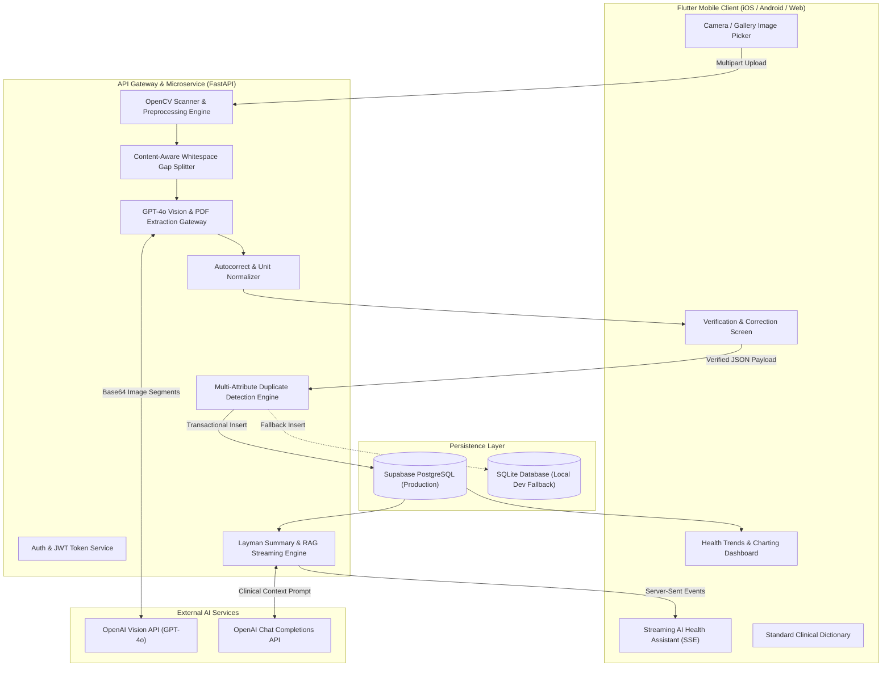
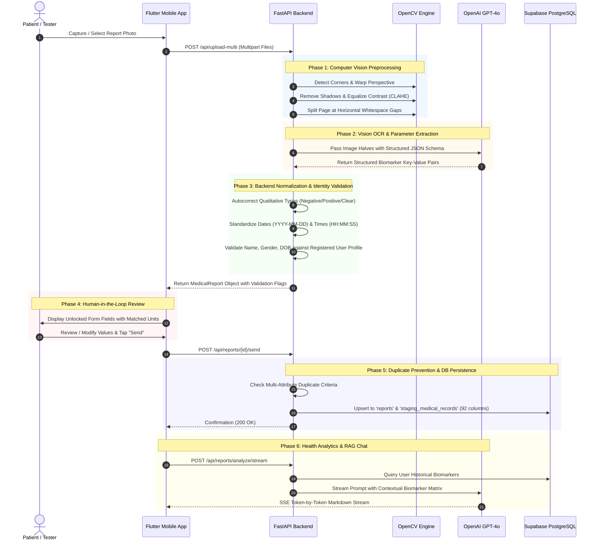

# 🏛️ MedScan — System Design Document

## 1. Executive Summary

**MedScan** is a full-stack, AI-powered clinical report digitization and health intelligence platform. It bridges the gap between physical medical laboratory documents (paper printouts, scanned PDFs, screen captures) and structured longitudinal health datasets.

MedScan employs an **AI-driven Vision-Language pipeline (OpenAI GPT-4o Vision)** combined with **OpenCV computer vision preprocessing** to parse complex, multi-format medical laboratory reports. Extracted clinical parameters are validated, normalized against a standardized clinical data dictionary, mapped to a relational database, and served through interactive patient dashboards and a streaming conversational AI health assistant.

---

## 2. System Objectives & Design Principles

| Objective | Architectural Decision | Rationale |
| :--- | :--- | :--- |
| **High OCR Accuracy on Dense Tables** | Multi-Segment Content-Aware Page Splitting & CLAHE Preprocessing | Medical reports feature tight row spacing and small fonts. Splitting along horizontal whitespace gaps prevents OCR line skipping and token truncation. |
| **Zero Ingestion of Corrupted Data** | Human-in-the-Loop Verification & Multi-Layer Typo Correction | Clinical data demands 100% fidelity. Automated prefix autocorrect fixes common optical errors, while the verification UI allows user review before database commit. |
| **Longitudinal Trend Analytics** | Standardized 92-Column Staging Schema & Unit Conversion | Laboratory data from different clinics use disparate units (e.g., mg/dL vs. mmol/L). All measurements are normalized to standard units for unified time-series charting. |
| **Data Privacy & Security** | JWT Authentication, Patient Demographic Verification & Supabase RLS | Ensures reports belong to the verified account holder by cross-referencing NRIC/Passport, DOB, and Gender metadata extracted from the document. |
| **Developer Extensibility** | Dual-Engine Abstract Persistence (Supabase PostgreSQL + SQLite Fallback) | Facilitates zero-configuration local developer testing while offering production-ready cloud scalability. |

---

## 3. High-Level System Architecture

MedScan is organized into a modular **Client-Server Service Architecture** comprising a Flutter mobile/web client, a FastAPI asynchronous backend microservice, an OpenCV computer vision engine, an OpenAI Vision/LLM gateway, and a cloud relational database.

---

## 4. End-to-End Data Processing Lifecycle

The lifecycle of a medical report follows six discrete phases:

---

## 5. Security & Multi-Tenant Isolation Model

### 5.1 Authentication & Token Lifecycle
* **Authentication Scheme**: Stateless JSON Web Tokens (JWT) signed using `HS256` with a configurable secret (`JWT_SECRET`) and a 30-day expiration window.
* **Password Hashing**: Passwords are encrypted using standard `bcrypt` with automatic salting.
* **Token Transport**: Clients transmit tokens via the `Authorization: Bearer <token>` HTTP header.
* **Offline Resilience**: Tokens and profile demographics are cached locally via `SharedPreferences`. The app validates tokens on startup via `/api/auth/me`, falling back gracefully to cached credentials if offline.

### 5.2 Patient Identity Verification Heuristics
To prevent accidental or unauthorized cross-patient report uploads in multi-user settings:
1. **Name Matching**: Tokenizes extracted report patient name and registered profile name. Normalizes case, removes salutations (Mr, Mrs, Dr), and computes Jaccard word-overlap. Flags mismatch if similarity $< 50\%$.
2. **Gender Matching**: Cross-references extracted gender against user profile (`Male`/`Female`). Flags mismatch on explicit discrepancy.
3. **Age & DOB Cross-Verification**: If Malaysian NRIC (`YYMMDD-PB-###G`) is detected on the report or user profile, the birth date is extracted and compared against the recorded Date of Birth.
4. **Tester Bypass Option**: A `force=true` query parameter allows developers and testers to intentionally bypass demographic mismatch blocks during development.

### 5.3 Row Level Security (RLS) & Supabase Access
* Supabase PostgreSQL tables (`users`, `reports`, `chat_sessions`, `chat_messages`, `staging_medical_records`) have **Row Level Security (RLS)** enabled.
* In accordance with Supabase Post-May 2026 standards, explicit permissions (`GRANT SELECT, INSERT, UPDATE, DELETE`) are granted to `anon`, `authenticated`, and `service_role` roles.
* API service queries enforce strict tenant separation by indexing and filtering every request by the authenticated `user_id`.

---

## 6. Fault Tolerance & Reliability Mechanisms

1. **Dual Storage Engine Fallback**: If cloud Supabase credentials are not configured or connection drops, the system seamlessly initializes a local SQLite database (`medical_reports.db`), ensuring continuous offline development and testing.
2. **HTTP/2 Connection Drop Protection**: Supabase edge gateways can terminate long-running multipart HTTP/2 connections. The backend explicitly configures `httpx.Client(http2=False, timeout=60.0)` for rock-solid HTTP/1.1 communication.
3. **Database Schema Auto-Healing**: When committing 92-column biomarker records to Postgres, string-to-numeric casting mismatches are caught dynamically. The backend catches PostgREST syntax error codes (`PGRST204`, `22P02`), isolates the conflicting column, strips non-numeric characters, and retries the transaction.
4. **Token-Aware Rate Limiting & Streaming**: AI health analysis queries stream responses via Server-Sent Events (SSE), reducing initial Time to First Byte (TTFB) to $< 800\text{ms}$.
